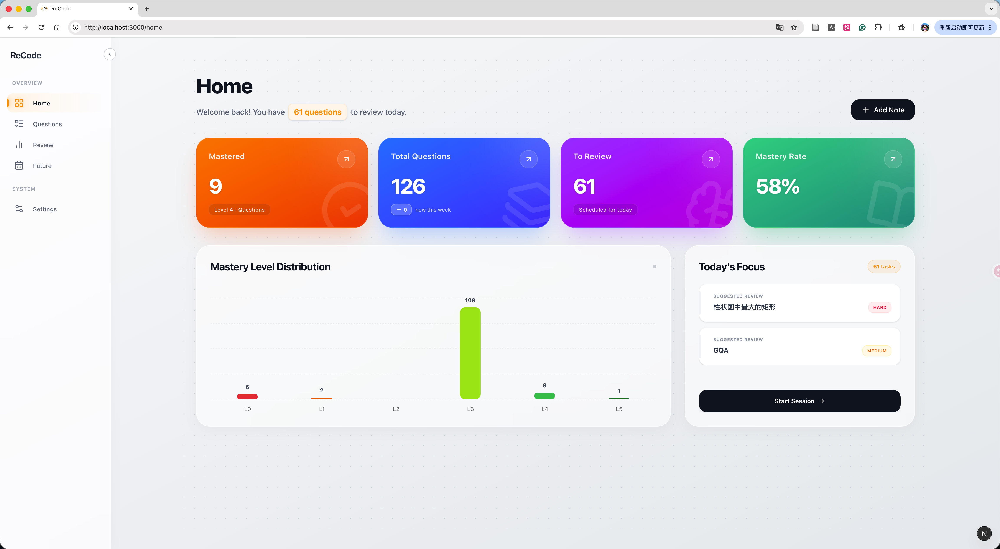
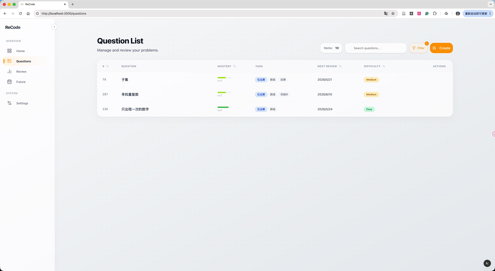
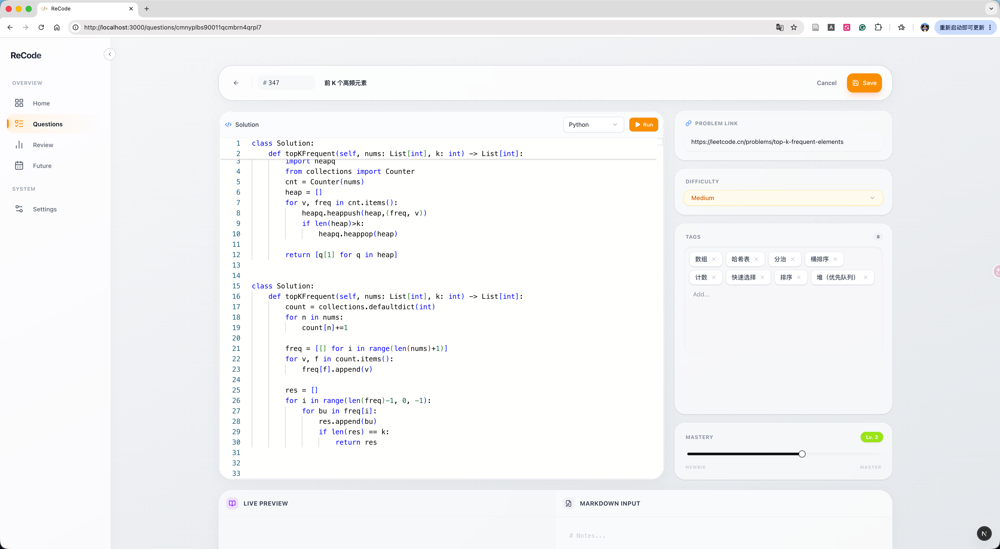
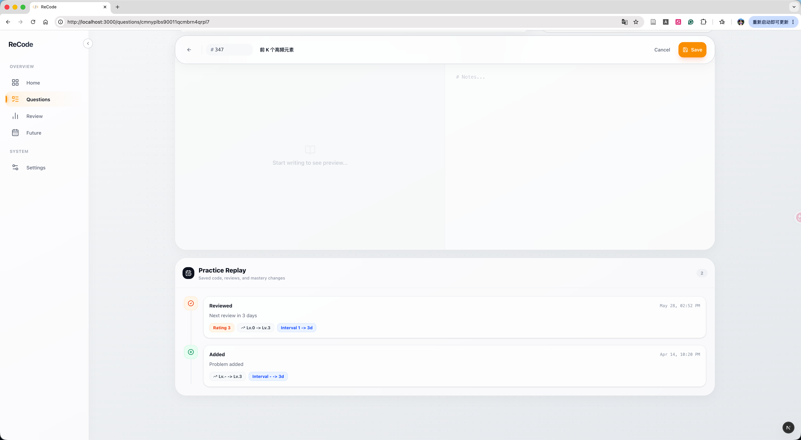
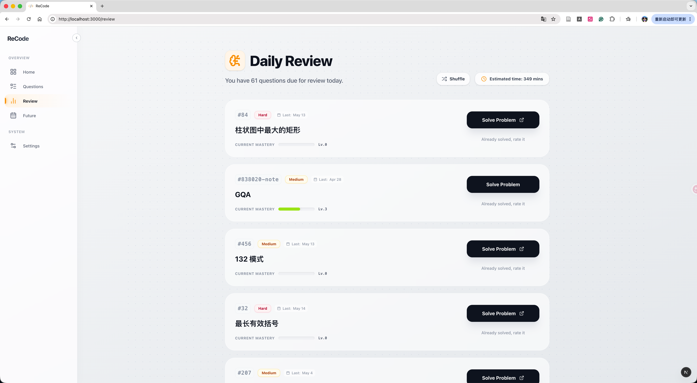
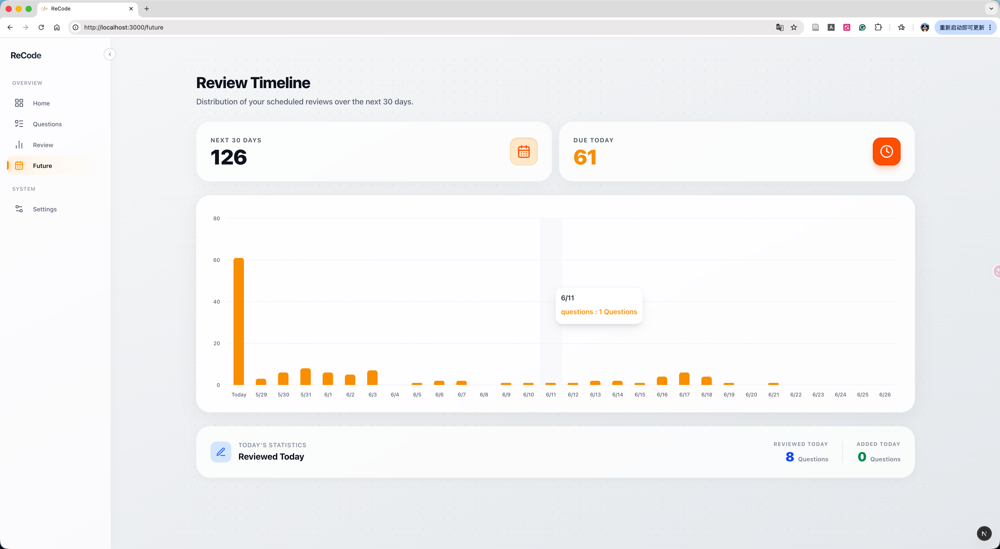

# ReCode Plus - 本地优先的算法复习与笔记系统

[English](./README.md)

ReCode Plus 是一个面向个人使用的算法练习管理工具。它把题目笔记、当前代码、掌握度评分、间隔复习计划和刷题回放时间线放在同一个本地应用里，适合长期维护自己的算法题库。

项目当前以本地源码方式运行，数据默认存储在本机 SQLite 文件中。

## 功能概览

- **本地题库管理**：记录题号、标题、难度、标签、题目链接、笔记和当前代码。
- **间隔复习计划**：根据题目难度、掌握度评分和复习次数计算下一次复习时间。
- **每日复习队列**：自动列出今天需要复习的题目，并支持打分后更新 SRS 状态。
- **对话式复习 Agent**：提供独立的复习工作区，可使用本地 Ollama 或远程 OpenAI-compatible API，并通过按需弹出的代码编辑器完成复习。
- **刷题回放时间线**：记录题目创建、代码保存、复习评分等事件，方便回看一道题的练习轨迹。
- **代码编辑与运行**：内置 Monaco Editor，支持 TypeScript、JavaScript、Python、Java、C++ 的本地执行。
- **Markdown 笔记**：支持 Markdown、代码高亮和 LaTeX 数学公式。
- **学习概览**：主页展示掌握度分布、待复习数量、本周新增题目和推荐复习题。
- **未来复习视图**：展示未来 30 天的复习任务分布。
- **本地数据可控**：所有数据保存在 `prisma/dev.db`，方便备份、迁移和自托管。

## 截图

> 主页概览，展示今日待复习、掌握度分布和推荐复习题。


> 题目列表，展示搜索、筛选、题目预览弹窗和刷题回放时间线。


> 题目编辑页，展示代码编辑器、元信息侧栏、Markdown 笔记和时间线。

 

> 每日复习页，展示复习卡片、评分按钮和题目预览。


> 未来复习页，展示未来 30 天复习任务柱状图。


## 技术栈

- 框架：`Next.js 16`
- UI：`React 19`, `Tailwind CSS 4`, `Framer Motion`, `Radix UI`
- 数据库：`SQLite` + `Prisma`
- 编辑器：`Monaco Editor`
- AI：本地 `Ollama` + `qwen2.5-coder:7b`，或远程 OpenAI-compatible API
- 文档渲染：`React Markdown`, `KaTeX`, `rehype-highlight`
- 状态管理：`Zustand`

## 数据模型

核心数据由 Prisma 管理：

- `User`：本地用户与偏好设置
- `Problem`：题目元信息
- `Progress`：用户对题目的掌握度、复习状态和 SRS 参数
- `Submission`：当前代码记录。一个 `Progress` 最多一条当前代码，保存时更新，不保留代码历史副本
- `ReviewEvent`：时间线事件，例如题目创建、代码保存、复习评分
- `AgentReviewSession`：可恢复的本地 Agent 复习状态，以及用户最终确认的结果
- `AgentMessage`：一次 Session 中持久化的用户/助手消息和受限 UI 动作

默认数据库文件：

```text
prisma/dev.db
```

## 快速开始

### 环境要求

- `Node.js` 20 或更高版本
- `npm`
- 如需真实 Agent 回复：安装 Ollama 本地模型，或准备 OpenAI-compatible 远程 API

### 自动启动

Windows：

```text
双击 start_windows.bat
```

Mac / Linux：

```bash
chmod +x start_mac.sh
./start_mac.sh
```

首次运行时，脚本会自动安装依赖、生成 Prisma Client、同步数据库，并启动开发服务。本地模式会按需安装 Ollama、下载约 4.7 GB 的默认 7B 模型；远程模式会跳过全部 Ollama 步骤。后续运行会跳过未变化的初始化步骤，模型下载中断后可再次运行脚本续传。如需强制完整检查，可运行 `./start_mac.sh --setup`。

### 手动启动

1. 安装依赖

```bash
npm install
```

2. 初始化数据库并生成 Prisma Client

```bash
npx prisma generate
npx prisma db push
```

3. 启动应用

```bash
npm run dev
```

然后访问：

```text
http://localhost:3000
```

首次进入时，如果数据库中没有用户，会自动跳转到 onboarding 页面。填写用户名、首选编程语言和界面语言后即可开始使用。

## 对话式复习 Agent

独立的 `/agent-review` 页面不会改变已有的首页、题目页和普通复习页。页面刚打开时，只根据本地复习数据展示建议气泡；只有选择建议或发送消息后，才会调用模型。

在一次复习中，Agent 可以引导对话、请求打开编程弹窗、分析你明确提交的代码，并整理复习总结。运行代码和最终确认复习结果仍必须由用户主动触发。

### 方案一：本地 Ollama（默认）

1. 安装 [Ollama](https://ollama.com/download)，并确认终端中可以使用 `ollama`。
2. 一次性下载默认模型：

```bash
ollama pull qwen2.5-coder:7b
```

默认 7B 模型约 4.7 GB，具有 32K 上下文。`start_mac.sh` 会在缺少 Ollama 或模型时自动安装并下载；如果安装或下载失败，脚本会给出警告并继续启动普通应用。

如只想快速验证流程，可以改用 `qwen2.5-coder:3b`（约 1.9 GB）；内存充足时可使用 `qwen2.5-coder:14b`（约 9 GB）。模型体积数据来自 [Ollama 模型页](https://ollama.com/library/qwen2.5-coder)。

随后运行：

```bash
./start_mac.sh
```

访问 [http://localhost:3000/agent-review](http://localhost:3000/agent-review) 即可使用 Agent。

### Agent 配置

自动生成的 `.env` 默认包含：

```env
AGENT_PROVIDER="ollama"
OLLAMA_BASE_URL="http://localhost:11434"
OLLAMA_MODEL="qwen2.5-coder:7b"
AGENT_MOCK_MODE="false"
```

- `OLLAMA_BASE_URL` 用来配置本机 Ollama 地址。出于隐私考虑，Agent 只接受 `localhost` 或 `127.0.0.1` 地址。
- `OLLAMA_MODEL` 用来选择已安装的复习模型。
- `AGENT_MOCK_MODE="true"` 可在没有 Ollama 时返回固定的模拟回复，方便开发 Agent 界面。

### 方案二：远程 OpenAI-compatible API

任何提供标准 `/models` 和 `/chat/completions` 接口的服务都可以接入。在 `.env` 中配置：

```env
AGENT_PROVIDER="openai-compatible"
AGENT_BASE_URL="https://your-provider.example/v1"
AGENT_API_KEY="your-secret-api-key"
AGENT_MODEL="your-model-name"
AGENT_TIMEOUT_SECONDS="120"
AGENT_MOCK_MODE="false"
```

- Base URL 应包含版本前缀（通常为 `/v1`），不要附加 `/chat/completions`。
- 非本机远程 URL 必须使用 HTTPS。
- API Key 只由 Next.js 服务端读取，不会返回浏览器，也不要提交 `.env`。
- 远程模式运行 `./start_mac.sh` 时会跳过 Ollama 安装、服务启动和模型下载。
- 题目、代码、Note 和最近对话会发送给远程提供商；敏感内容请使用本地模式。

临时以 Mock 模式启动一次：

```bash
AGENT_MOCK_MODE=true ./start_mac.sh
```

如需长期使用 Mock 模式，可以修改 `.env`；测试真实本地推理前请改回 `false`。

### 手动启动 Agent

如果希望分别管理进程，可以先在一个终端启动 Ollama：

```bash
ollama serve
```

完成常规 Prisma 初始化后，在另一个终端启动 ReCode Plus：

```bash
npm run dev
```

浏览器只与 Next.js 服务端通信；服务端再根据 `AGENT_PROVIDER` 将复习上下文发送给本机 Ollama 或远程 API。

## 常用命令

```bash
npm run dev
```

启动开发服务。

```bash
npm run build
```

构建生产版本。

```bash
npm run lint
```

运行 ESLint。

```bash
npx tsc --noEmit
```

运行 TypeScript 类型检查。

```bash
npx prisma db push
```

把 `prisma/schema.prisma` 同步到本地 SQLite 数据库。

```bash
npx prisma studio
```

打开 Prisma Studio 查看或管理本地数据。

## 数据备份与迁移

备份时复制这个文件即可：

```text
prisma/dev.db
```

换电脑时，把 `dev.db` 放回新环境的 `prisma/` 目录，然后运行：

```bash
npm install
npx prisma generate
npm run dev
```

## 注意事项

- 这是本地优先应用，没有账号系统和云同步。
- `prisma/dev.db` 是个人数据文件，建议定期备份。
- 当前使用 `prisma db push` 维护本地数据库结构。如果多人协作或正式发布，建议改用标准 Prisma migration 流程。
- 本地代码执行依赖系统环境，例如 `node`、`python3`、`javac`、`g++`。缺少对应运行时会导致该语言执行失败。
- 普通题库功能不依赖模型；只有在关闭 Mock 模式且无法连接所选本地或远程模型时，对话式 Agent 会不可用。

## 致谢

感谢 [CoisiniIce/ReCode](https://github.com/CoisiniIce/ReCode)。本项目是在该项目基础上继续展开，并增添新的功能与调整后形成的版本。

## 开源协议

本项目使用 [MIT License](./LICENSE)。
